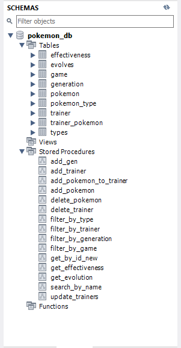

# Pokemon Database
Created by Dan Peluso, Josh Alter, and Nithila Ramen for CS3200 at  
Northeastern University
test

### What is Pokemon Databse?
Pokemon Database (or Poke-Queue) is a simple front end user experience  
for access to the Pokemon_db relational database written in MySQL. This  
is the final project for CS3200 - Database Design at Northeastern  
University. The project required us to make a database application and  
build a database for it to work with. We decided to use Pokemon after  
getting inspiration from all the data available online about various  
Pokemon, games, generations, and much more. The show and game feature  
a device called a 'Pokedex'

### Getting Started

The app is comprised of 3 main components necessary for running the  
Android app with a connection to the pokemonn DB.
- MySql Local Server
- Python Flask local web server
- Android Application

While more than a traditional Java application using the MySQL connector  
to the database, this step was taken to further modularize the  
project's dependencies. The Flask server routes GET requests made from URL
to the MySQL Python drivers and returns the local server responses
in JSON format for easy deserialization.

### Setting Up the MySQL Database

Open the file `PokemonDatabase/dbdump.4.12.sql` in MySql workbench and
start the local server. You will need your host username and password
to connect to the local server. You will also need your private IP
address, which can be found by typing the commend `ipconfig` in the
terminal on any Windows machine. It will be listed under WiFi adapters
next to the label 'IPv4'. Check to make sure the database is running on
the server by refreshing the database. You should see the following:


Check to see the Pokemon table matches the following:


You are now ready to start the Python Flask server!

### Setting Up the Python Flask Web Service

All the files associated with running the python script are located in
`PokemonDatabase/backend/`. You need to change to variables in the app.py
file to reflect the correct username and password to the MySQL server.
```
cnx = pymysql.connect(
        host='localhost',
        user="root",
        password="password",
        db='pokemon_db',
        charset='utf8mb4',
        cursorclass=pymysql.cursors.DictCursor)
```

You will need to set up an interpreter with
the ability to import `cryptography, Flask, and PyMySQL`. To do this to
our projects specification, use the command
```
pip install -r requirements.txt
```
Once these packages are installed, run the app.py file (ex. ‘Python app.py’ or ‘py -3 app.py’).
If the server is running correctly, you will see the following text in
the terminal:


To be sure the web service is running properly, we recommend typing the
following link into a web browser and seeing if the proper response is
presented.
```
http://127.0.0.1:5000/api/v1/database/g_all
```
All of our Database operations through the ORM API are returned in JSON
format. This line queries our Pokemon table to return the following list
of Pokemon objects:
```
[
  {
    "HP": 45, 
    "attack": 49, 
    "defense": 49, 
    "evolve_id": 2, 
    "generation": 1, 
    "idNum": 1, 
    "name": "Bulbasaur", 
    "special_attack": 65, 
    "special_defense": 65, 
    "speed": 45
  }, 
  {
    "HP": 60, 
    "attack": 62, 
    "defense": 63, 
    "evolve_id": 3, 
    "generation": 1, 
    "idNum": 2, 
    "name": "Ivysaur", 
    "special_attack": 80, 
    "special_defense": 80, 
    "speed": 60
  }, 
  {
    "HP": 80, 
    "attack": 100, 
    "defense": 123, 
    "evolve_id": 5, 
    "generation": 1, 
    "idNum": 3, 
    "name": "Venusaur", 
    "special_attack": 122, 
    "special_defense": 120, 
    "speed": 80
  }, 
```

This shows that the ORM is working, and displays the first 3 Pokemon
in the database (conveniently the full evolution of Bulbasaur). You can
test out any of the URL endpoints by typing them into your web browser
while the local SQL server is running.

### Using the Android Application

To install the Android App, the user can either open the full project in
[Android Studio](https://developer.android.com/studio/index.html) or directly install the .apk from `PokemonDatabase/pokeMonDatabaseApp.apk.

#### Connecting

The most important piece of using the app is connecting to the local database
before using any of the button functions. To do this, you must click the
'Connect' button at the bottom of the screen and enter in the IP address
from the machine running the Python ORM and MySQL server.


The first screen of the app shows ‘Database not connected’ and indicates  
 that the other buttons being pressed may cause crashing of the app.

 #### Selecting

 To access filtered views of the Pokemon database, click on the select
 button on the main screen. The first screen will show the entire Pokemon
 database on a Recyclerview with some reduces stats. To filter the Pokemon,
 click on the button labeled 'Select Filter Term' and choose an option
 from the dropdown. Then, type your search term in the edit text and press
the 'Search Database' button.


#### Creating / Updating / Deleting

The app allows for users to make modifications to the database with some
simple user input on the main screen. The following diagram shows some of
the buttons and input popups they release.
- Create
  - Pokemon
  - Trainer
  - Trainer to Pokemon
  - Generation
- Delete
  - Pokemon
  - Trainer
- Update
  - Trainer

Upon successful operation, a toast message will display at the bottom of  
the screen notifying the user that the operation was successful.


#### Fighting

The final feature of our app is the simulated fighting of two Pokemon
stored in the database using effectiveness, HP, and attack / defense.
Clicking on the 'Fight' button launches the following activity. First,
enter two Pokemon IDs in the input boxes at the top of the screen. Then,
click the 'Get Pokemon from ID' button to see information about the two
selected Pokemon. Finally, click the 'FIGHT' button to see who the winner
of the simulated battle was!


### Conclusions

Thanks to imgur user Lochewood for the Pikachu background used throughout
the application, [Veekun](https://github.com/veekun/pokedex/blob/master/pokedex/data/csv/pokemon_evolution.csv) for the Evolution ID table values,.
and to [Armgilles](https://gist.github.com/armgilles/194bcff35001e7eb53a2a8b441e8b2c6) for the main Pokemon database.